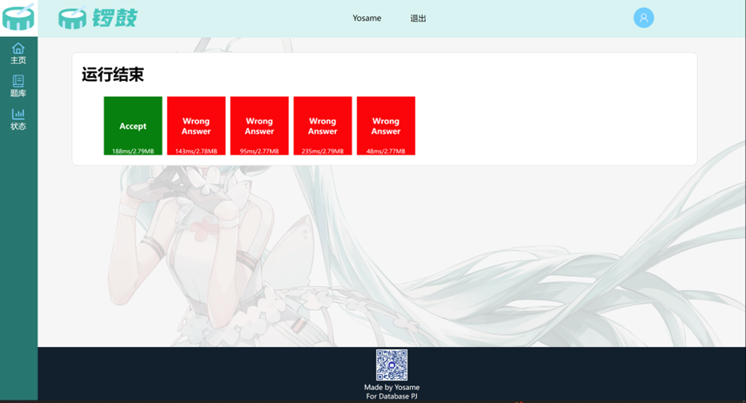

# 数据库PJ - 在线判题系统“锣鼓”

在线判题系统Online Judge（OJ）是一种在算法竞赛中用来测试参赛程序的在线系统，判定程序的输出、耗时等是否符合题目要求，主要提供题库、评测等功能。

## 技术栈

前端：Jinja2

后端：Flask(Python)

前后端耦合

## 数据库模型

users：存储用户

problem：存储题目信息

data：存储题目的测试用例

submission：存储代码评测记录

数据库满足3NF

## 数据库操作

### 三种权限

	游客、普通用户、管理员
	游客只允许浏览，不允许提交代码
	普通用户不可修改题目
	管理员拥有所有权限

### 增/删

	管理员可增删题目

### 改

	任何用户可以更改自己的个人信息
### 查

	获取题目列表、获取提交记录等
